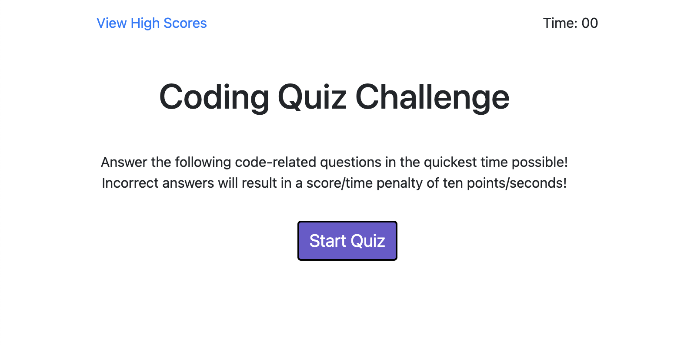

# Coding Quiz

## Purpose
Site displays an interactive quiz that allows a user to "Start Quiz" and answer questions related to coding. Timer runs upon start of the quiz. CSS and bootstrap is utilized to give the user an aesthetically appealing look with regards to buttons that have a differing color hover quality as well. The aim of the quiz is to have the time counted as score, whereby an incorrect answer results in a deduction of ten seconds/points. The high score page is linked to another HTML document that will store the database for high scores.

## Built With
* HTML
* CSS
* JAVASCRIPT

## Initial Landing Page View

## Website
Link to live URL: https://robbiemurphy7.github.io/code-quiz/